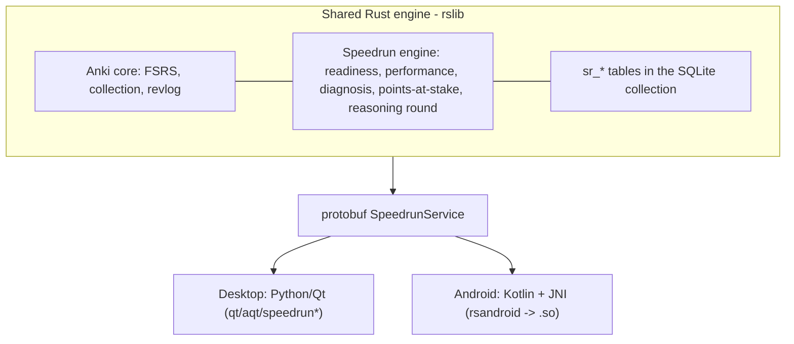

# Speedrun

An Anki-native study app for **desktop and Android** that separates three signals
other tools blend — **memory** (can you recall a fact), **performance** (can you
apply it on a new exam-style question), and **readiness** (what you'd score
today, honestly) — and turns every wrong answer into a **diagnosis** routed to a
concrete next action.

- **Exam:** MCAT, scored **472–528** (four sections, 118–132 each).
- **Two apps, one engine:** desktop (Python/Qt) and Android (Kotlin/JNI) both run
  the same Anki **Rust** core, extended with the Speedrun engine over the
  existing protobuf boundary. No scheduler is reimplemented on the client.
- **AI is off by default.** The deterministic classifier is the required path and
  the baseline any optional AI must beat — with AI off, no question or
  self-explanation is ever sent to a model.
- **Honest by design:** readiness refuses to show a number until there is enough
  evidence, and always shows its range and what's missing.

This is a fork of [Anki](https://github.com/ankitects/anki) (Ankitects Pty Ltd).
License: **AGPL-3.0-or-later** (see [LICENSE](./LICENSE)); some upstream parts are
BSD-3-Clause.

---

## What it does

- **Three separate scores**, each with a range and an explicit give-up rule
  (`ComputeReadiness`): memory from the FSRS substrate, performance from held-out
  exam-style questions, readiness mapped to the 472–528 scale.
- **Points-at-stake queue** — the graded Rust engine change: reorders due cards by
  topic weight × weakness × the recall-vs-performance gap, so the highest-value
  cards come first. Gated by a config toggle (which doubles as the ablation switch)
  and undo-safe.
- **Diagnosis + routing** — a deterministic classifier labels each miss (memory /
  reasoning / passage / test-taking) and routes it to a repair; the student can
  correct a diagnosis.
- **Optional AI coach** — a source-grounded, abstaining diagnosis on **both**
  desktop and phone; off by default, gated on beating the deterministic baseline,
  grounds each call in a cited source, and never reveals the answer. It reads the
  student's own self-explanation as primary evidence.
- **Recall → performance bridge** — held-out, reworded questions (never added as
  cards, so no leakage) measure the gap between remembering and applying.
- **End-of-session reasoning round** — after a review session, a short check drawn
  from the concepts just reviewed (card-linked → topic-matched → fallback).
- **Coverage map, calibration, exam-anchored plan, leakage check** — all AI-off.

---

## Where the Speedrun code lives

| Layer                | Path                                                                                                                                                                                                    |
| -------------------- | ------------------------------------------------------------------------------------------------------------------------------------------------------------------------------------------------------- |
| Engine (Rust)        | `rslib/src/speedrun/` (`mod.rs`, `service.rs`, `readiness.rs`, `performance.rs`, `coverage.rs`, `calibration.rs`, `exam.rs`, `leakage.rs`, `interleave.rs`, `points_at_stake.rs`, `reasoning_round.rs`) |
| Storage              | `rslib/src/storage/speedrun/` (`tables.sql`, `add.sql`, `get.sql`, `mod.rs`) — `sr_*` tables created idempotently on open                                                                               |
| Scheduler hook       | `rslib/src/scheduler/queue/builder/mod.rs` (points-at-stake reorder)                                                                                                                                    |
| Protobuf boundary    | `proto/anki/speedrun.proto` (`SpeedrunService`)                                                                                                                                                         |
| Desktop (Python/Qt)  | `qt/aqt/speedrun.py`, `speedrun_theme.py`, `speedrun_library.py`, `speedrun_voice.py`; wired from `qt/aqt/main.py`                                                                                      |
| Android (Kotlin/JNI) | `androidapp/` (app) + `rsandroid/` (JNI bridge → `librsandroid.so`)                                                                                                                                     |
| Tools / evals        | `tools/speedrun_*.{sh,py}`, `tools/import_*`, `tools/build_e2e_apkg.py`                                                                                                                                 |

---

## Setup — Desktop (macOS / Linux / Windows)

Verified on macOS (Apple Silicon). The same build system targets Linux and Windows.

### Prerequisites

- **Rust** via [rustup](https://rustup.rs) — the toolchain auto-pins to `1.92.0`
  from `rust-toolchain.toml`.
- **Protobuf** compiler (`protoc`): `brew install protobuf` (macOS) /
  `apt install protobuf-compiler` (Debian/Ubuntu).
- Node and a recent Python are bootstrapped by the build; on macOS you also need
  Xcode command-line tools.

### Run from source

```bash
# from the repo root
PROTOC=$(which protoc) ./run
# equivalently, via the justfile:
just run
```

First launch builds `pylib` + `qt`, then opens Anki with the Speedrun
integration. Import an MCAT deck (or use the bundled biology example via
**Tools → Speedrun → Content library → Add e2e test**), then:

- **Dashboard** (top toolbar, next to Sync) — the three signals, always available.
- Open a deck → the **Speedrun panel** (readiness ring, signals, bridge, next
  best action, Settings gear for the study toggles).
- **Study Now** — self-explain before reveal, then a post-miss diagnosis.

### Build the installer

```bash
RELEASE=2 ./ninja installer        # or: ./tools/build-installer
# output: out/installer/dist/anki-<version>-mac-<arch>.dmg
```

This bundles the Speedrun-built wheels (the modified `_rsbridge.so` engine and
the `aqt/speedrun*` modules) into a drag-to-Applications `.dmg` (~216 MB). It has
been verified to launch on a clean profile and provision the `sr_*` evidence
tables (see `.ui-preview/sunday/desktop-clean-install.md`). The dev build is
ad-hoc signed — on a clean machine, right-click → **Open** the first time.

---

## Setup — Android

### Prerequisites

- **Android SDK** (platform `android-34`, build-tools) + platform-tools (`adb`) —
  easiest via Android Studio's SDK Manager.
- **Android NDK** r26 or r27 (e.g. `26.3.11579264`); set `ANDROID_NDK_HOME`.
- **JDK 21** (bundled with Android Studio at `.../jbr`).
- Rust cross-compile: `rustup target add --toolchain 1.92.0 aarch64-linux-android`
  and `cargo install cargo-ndk`.

### 1. Build the native engine (`librsandroid.so`)

Rerun this whenever `proto/anki/speedrun.proto` or `rslib` change (otherwise the
phone gets `InvalidMethodIndex`):

```bash
cd rsandroid
export ANDROID_NDK_HOME="$HOME/Library/Android/sdk/ndk/26.3.11579264"
PROTOC=$(which protoc) cargo ndk -t arm64-v8a \
  -o ../androidapp/app/src/main/jniLibs build --release
```

### 2. Build & install the app

```bash
cd ../androidapp
export JAVA_HOME="/Applications/Android Studio.app/Contents/jbr/Contents/Home"
export ANDROID_HOME="$HOME/Library/Android/sdk"
./gradlew :app:installDebug        # or :app:assembleDebug to produce an APK
```

On first launch the app opens-or-creates the collection. On an empty device it
seeds the bundled **biology example deck**; otherwise import from the **Library**
tab (popular decks, MMLU pack, biology e2e, or paste a link / pick a file).

### Sync (AnkiWeb cloud, or device-to-device)

Speedrun rides Anki's standard sync, so evidence travels on **any** Anki server —
including AnkiWeb, with no self-hosting. The Speedrun-specific data a stock server
would otherwise drop (`sr_attempts` — diagnoses, confidence, self-explanations) is
**encoded as hidden Anki notes** before each sync and decoded back afterward, so it
survives an AnkiWeb round-trip on the battle-tested note/revlog path.

**AnkiWeb (cloud, no LAN).** Sign in once and stay signed in; later syncs reuse the
session with no password re-entry.

- Desktop: **Sync to AnkiWeb** (toolbar).
- Phone: **Settings → Sync → AnkiWeb → Sign in**, then **Sync**.

AnkiWeb shards accounts across hosts and 308-redirects the base to the account's
shard; the client follows that redirect on every request — including the full
upload/download used the first time a schema change forces a full sync.

**Device-to-device (LAN / USB, no account).** The desktop hosts a bundled
`anki-sync-server` and the phone pairs by scanning a QR (server URL + user +
token), with manual entry as a fallback — handy for offline or guest-Wi-Fi demos.

- Desktop: **Sync with phone** shows the pairing QR and hosts the local server.
- Phone: **Sync** tab -> scan the QR once, then **Sync now**.

Offline review is local-first: reviews taken with no connection sync on reconnect,
with no lost or double-counted reviews. Verified live on a Galaxy S23 (phone review
-> desktop `revlog` 3 -> 5; offline review -> reconnect -> `revlog` 5 -> 7). A
reproducible headless harness covers the device-to-device path:

```bash
./tools/speedrun_sync_check.sh    # two independent collections, two-way, no loss/dupe
```

For a one-way USB copy of an existing desktop deck (e.g. first-time seeding):

```bash
tools/push_deck.sh --media [path/to/collection.anki2]
```

---

## Architecture overview



Both clients call the identical `SpeedrunService` methods; the engine is compiled
into the desktop `pylib` bridge and into `librsandroid.so` for the phone.

---

## The Rust change (graded)

The engine change is the **Speedrun diagnostic evidence engine + points-at-stake
queue**, inside Anki's Rust core:

- **Evidence engine:** `sr_attempts` / `sr_readiness` / `sr_question_items` /
  `sr_topic_map` tables (created idempotently on collection open), a deterministic
  AI-off classifier, and the `SpeedrunService` protobuf service on `Collection`.
- **Points-at-stake queue:** due review cards are reordered by a weakness-weighted
  value score read from recorded evidence, wired into the live queue builder
  behind the `speedrunPointsAtStake` toggle. It only reorders already-due cards,
  so FSRS intervals and undo are untouched.

It belongs in Rust (not Python) because it is on the scheduling hot path, reads
the same storage the scheduler uses, and must ship identically to the phone — the
shared engine is the point.

Tests: `points_at_stake` (3 unit tests) + `reasoning_round` (6) + the readiness /
service tests, plus a Python test that drives the service through the real bridge
(`pylib/tests/test_speedrun.py`).

---

## Running the tests & evaluation

```bash
# One command: Rust tests + Python bridge tests + every tool self-test
PROTOC=$(which protoc) ./tools/speedrun_check.sh

# Individually:
cargo test --workspace --exclude rsbridge -- speedrun points_at_stake reasoning_round
PYTHONPATH=out/pylib:pylib out/pyenv/bin/pytest -q pylib/tests/test_speedrun.py
./tools/speedrun_benchmark.sh     # three signals + calibration + leakage on a collection
./tools/speedrun_ablation.sh      # points-at-stake ON vs OFF
./tools/speedrun_e2e.sh           # smoke: classifier + recall-vs-performance gap
./tools/speedrun_e2e_full.sh      # full pipeline: abstain -> real in-range score
```

---

## Submission docs

- [docs/speedrun/architecture.md](docs/speedrun/architecture.md) — architecture overview (one engine, three signals, data flow, sync).
- [docs/speedrun/rust-change.md](docs/speedrun/rust-change.md) — the graded Rust change: why it lives in Rust, tests, upstream files touched, merge cost.
- [docs/speedrun/model-notes.md](docs/speedrun/model-notes.md) — the memory / performance / readiness models and their give-up rules.
- [docs/speedrun/files-touched.md](docs/speedrun/files-touched.md) — annotated list of upstream files modified and Speedrun files added.
- [docs/speedrun/ai-note.md](docs/speedrun/ai-note.md) — what AI was built, why, and what was deliberately skipped.
- [project_brainlift.md](project_brainlift.md) — the research/thesis brainlift.

## Credits

Speedrun is built on [Anki](https://apps.ankiweb.net) by Ankitects Pty Ltd and
contributors. Upstream docs: [dev-docs.ankiweb.net](https://dev-docs.ankiweb.net).
