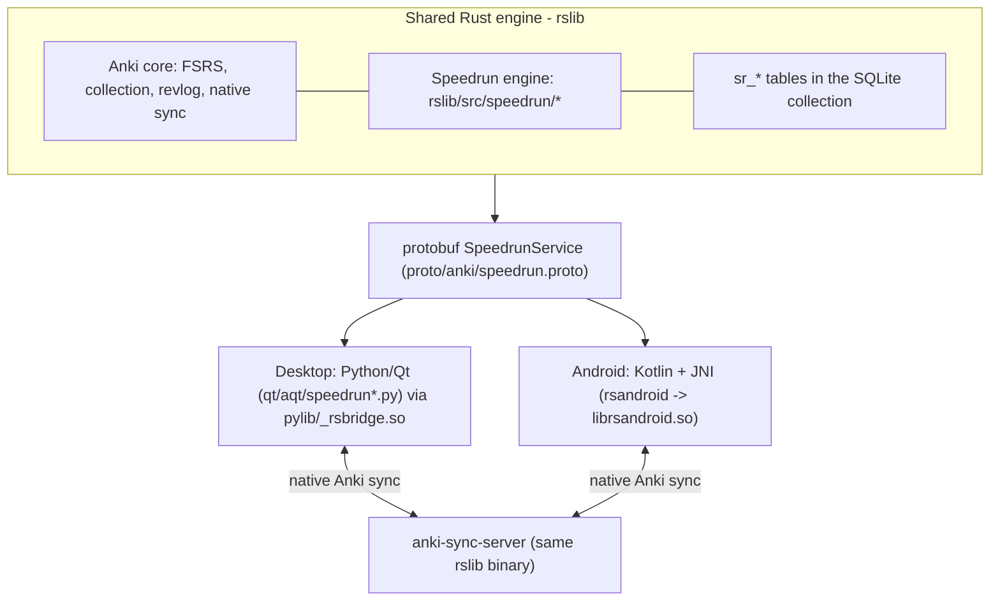
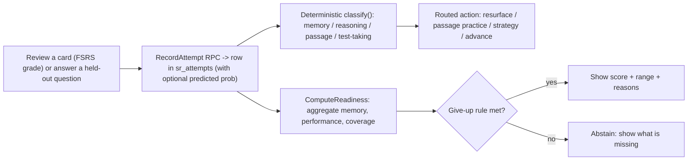

# Speedrun architecture overview

Speedrun is a fork of Anki for the MCAT.
It reuses Anki's Rust engine, FSRS scheduler, collection storage, and native sync, and adds a diagnostic evidence engine plus a points-at-stake review queue inside that engine.
The guiding constraint is that desktop and phone share one engine: any scoring, scheduling, or diagnosis logic lives in Rust so both clients get identical behaviour, and the AI path is enrichment that is off by default and never on the review hot path.

## The one-engine picture

Both clients call the identical `SpeedrunService` methods.
The engine is compiled into the desktop `pylib` bridge (`anki/_rsbridge.so`) and into `librsandroid.so` for the phone.
The sync server is the same `rslib` codebase, so server-side merge understands the Speedrun tables too.

## Layers and where the code lives

- Engine (Rust): [`rslib/src/speedrun/`](../../rslib/src/speedrun/) - `mod.rs` (the deterministic classifier), `readiness.rs`, `performance.rs`, `coverage.rs`, `calibration.rs`, `exam.rs`, `leakage.rs`, `interleave.rs`, `points_at_stake.rs`, `reasoning_round.rs`, `reasoning_schedule.rs`, `feedback.rs`, and `service.rs` (the protobuf service implemented on `Collection`).
- Storage (Rust): [`rslib/src/storage/speedrun/`](../../rslib/src/storage/speedrun/) - `tables.sql`, `add.sql`, `add_or_update.sql`, `get.sql`, `mod.rs`. The `sr_*` tables are created idempotently on collection open, so the upstream Anki schema version is untouched.
- Scheduler hook (Rust): [`rslib/src/scheduler/queue/builder/mod.rs`](../../rslib/src/scheduler/queue/builder/mod.rs) - the points-at-stake reorder + topic interleave, called from `build_queues`.
- Protobuf boundary: [`proto/anki/speedrun.proto`](../../proto/anki/speedrun.proto) - the `SpeedrunService` contract shared by both clients.
- Desktop (Python/Qt): [`qt/aqt/speedrun.py`](../../qt/aqt/speedrun.py) and siblings (`speedrun_theme.py`, `speedrun_ai.py`, `speedrun_mcat.py`, `speedrun_sync.py`, `speedrun_library.py`, `speedrun_grouping.py`, `speedrun_voice.py`), wired from `qt/aqt/main.py`.
- Android (Kotlin/JNI): [`androidapp/`](../../androidapp/) (Compose app) + [`rsandroid/`](../../rsandroid/) (the JNI bridge that produces `librsandroid.so`).
- AI + evals (off the hot path): `tools/speedrun_ai/` (the coach) and the `tools/speedrun_*` harnesses.

## The three separate signals

Speedrun refuses to blend the three questions a readiness number really answers.

- Memory: can you recall a fact. Derived from the FSRS substrate as the mature-card fraction (`ivl >= 21` over review cards), and its honesty is checked by calibration (Brier / log-loss on captured pre-answer predictions).
- Performance: can you apply it on a new, reworded exam-style question. Measured from held-out `sr_question_items` that are never added to the collection as cards, so answering them cannot leak into the source card's scheduling.
- Readiness: what you would score today on the 472-528 MCAT scale, as a point estimate plus a range, or an explicit abstention when evidence is thin.

See [model-notes.md](model-notes.md) for each model and its give-up rule.

## Data flow: one review -> diagnosis -> readiness

1. A review grade or a held-out question answer is sent to `RecordAttempt`, which writes an `sr_attempts` row and (for exam-style questions) runs the deterministic classifier.
2. The classifier ([`speedrun/mod.rs`](../../rslib/src/speedrun/mod.rs)) labels the miss (memory / reasoning / passage / test-taking) and routes it to a repair action; the student can correct the label via `UpdateAttemptDiagnosis`.
3. `ComputeReadiness` aggregates the raw evidence (mature cards, exam-style accuracy, topic coverage) into the three signals and applies the give-up rule before showing any number.
4. The recorded weakness also feeds the points-at-stake queue: when `speedrunPointsAtStake` is on, `build_queues` reorders already-due review cards by `topic_weight * (1 + weakness) + 0.5 * recall_perf_gap + recency`, so the highest-value cards surface first without changing FSRS intervals or breaking undo.

## Sync

Sync is Anki's native, request-based client<->server protocol; there is no separate JavaScript scheduler or copied progress.
Reviews sync through the standard revlog machinery.
The Speedrun `sr_attempts` table carries its own `usn` column and rides Anki's incremental changed-rows sync (see [ADR 0001](../../../docs/adr/0001-incremental-sr-attempts-sync.md)).
Because `sr_question_items` and the single-row `sr_profile` carry no `usn`, they are round-tripped through collection config so they survive incremental sync as well.
The desktop can host a bundled `anki-sync-server`, and the phone pairs to it by QR; a full phone -> server -> desktop round-trip was verified live on a Galaxy S23.

## Design invariants (kept honest on purpose)

- AI is enrichment, never a dependency. The deterministic classifier is the AI-off fallback and the eval baseline; every score is produced with AI off.
- AI is never on the review hot path. The coach and tutor are async and off the reviewer loop, protecting the latency budgets.
- Every AI output cites a named source and abstains below its cutoff; the coach transmits only question content and behavioural signals, never the on-device self-explanation transcript.
- Readiness abstains rather than inventing a number, and always shows its range, coverage, and the reason it is (or is not) confident.
