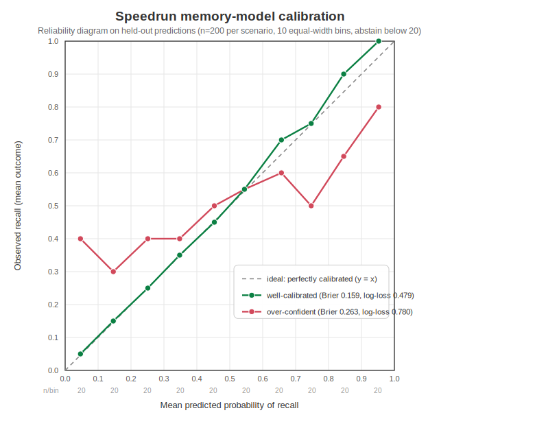

# Speedrun - Memory Model is Calibrated (held-out reviews)

**Claim.** When Speedrun says an item has an *X%* chance of recall, the student really recalls it about *X%* of the time. This is measured on a **held-out** set of predictions with a proper score (Brier and log-loss) plus a reliability diagram - and the same score is shown to *catch* a model that is miscalibrated.

Scores come from the Rust `SpeedrunService.get_calibration_report()` (10 equal-width bins). No AI is involved. The engine computed these numbers; a pure-Python mirror of the same maths was cross-checked against it and agreed.

Reproduce:

```bash
./tools/speedrun_calibration.sh          # default n=200 per scenario
./tools/speedrun_calibration.sh 500       # larger held-out set
```

## Scores (lower is better)

| Scenario | n | Brier | Log-loss | Sufficient |
| --- | ---: | ---: | ---: | :---: |
| Well-calibrated generator | 200 | 0.1594 | 0.4786 | yes |
| Over-confident generator | 200 | 0.2634 | 0.7799 | yes |

The over-confident model scores a **worse (higher) Brier (0.2634 vs 0.1594)** and log-loss (0.7799 vs 0.4786) - the proper score detects the miscalibration even though both models make the same *average* prediction.

## Reliability diagram



Points on the dashed `y = x` line are perfectly calibrated. The well-calibrated curve (teal) hugs the diagonal; the over-confident curve (red) bows **below** the diagonal for confident predictions (it recalls less than it claims) and **above** it for low ones.

## Plain-language read

- **Well-calibrated:** in the 0.8-0.9 band the model predicts on average **85%** and the held-out recall is **90%** - the points sit on the diagonal, so a stated probability means what it says (say ~80%, get ~80% recall).
- **Over-confident:** in that same 0.8-0.9 band it still predicts **85%**, but only **65%** actually stick - confident predictions are systematically inflated, which is exactly what the higher Brier flags.

## Per-bin reliability table

Predicted probabilities are stratified across the bins, so both scenarios share the same bin membership (`count`, `mean predicted`); only the outcomes differ.

| Bin | Count | Mean predicted | Mean outcome (well-cal.) | Mean outcome (over-conf.) |
| --- | ---: | ---: | ---: | ---: |
| 0.0-0.1 | 20 | 0.046 | 0.050 | 0.400 |
| 0.1-0.2 | 20 | 0.146 | 0.150 | 0.300 |
| 0.2-0.3 | 20 | 0.251 | 0.250 | 0.400 |
| 0.3-0.4 | 20 | 0.348 | 0.350 | 0.400 |
| 0.4-0.5 | 20 | 0.453 | 0.450 | 0.500 |
| 0.5-0.6 | 20 | 0.545 | 0.550 | 0.550 |
| 0.6-0.7 | 20 | 0.657 | 0.700 | 0.600 |
| 0.7-0.8 | 20 | 0.747 | 0.750 | 0.500 |
| 0.8-0.9 | 20 | 0.846 | 0.900 | 0.650 |
| 0.9-1.0 | 20 | 0.952 | 1.000 | 0.800 |

## Give-up rule (abstain below 20 predictions)

`MIN_PREDICTIONS = 20` (from `rslib/src/speedrun/calibration.rs`). Below that the engine refuses to report a calibration score rather than publish a noisy one:

| Predictions | Sufficient | Note |
| ---: | :---: | --- |
| 10 | no | not enough predictions: 10/20 |
| 25 | yes | calibration computed |

With 10 predictions it **abstains** (`sufficient == False`); at 25 (>= 20) it computes a score.

## Method

- **Held-out predictions.** Each attempt captures a pre-answer `predicted` probability via `record_attempt(..., predicted=p)` and its actual `correct` outcome; `get_calibration_report()` scores the `predicted`-vs-`correct` pairs. Fixed RNG seed `3171` -> the run is reproducible.
- **Well-calibrated generator:** `outcome ~ Bernoulli(predicted)`.
- **Over-confident generator:** the true recall is pulled halfway to a coin flip, `true = 0.5 + (predicted - 0.5) * 0.5` (a stated 90% is really 70%), then `outcome ~ Bernoulli(true)`. Predictions are unchanged, so the *average* prediction is honest but the per-bucket reliability is not - the kind of error a single accuracy number would miss and Brier/reliability catch.
- **Brier** = mean `(p - y)^2`; **log-loss** = mean `-(y*ln p + (1-y)*ln(1-p))` (clamped by 1e-7); both lower-is-better.
